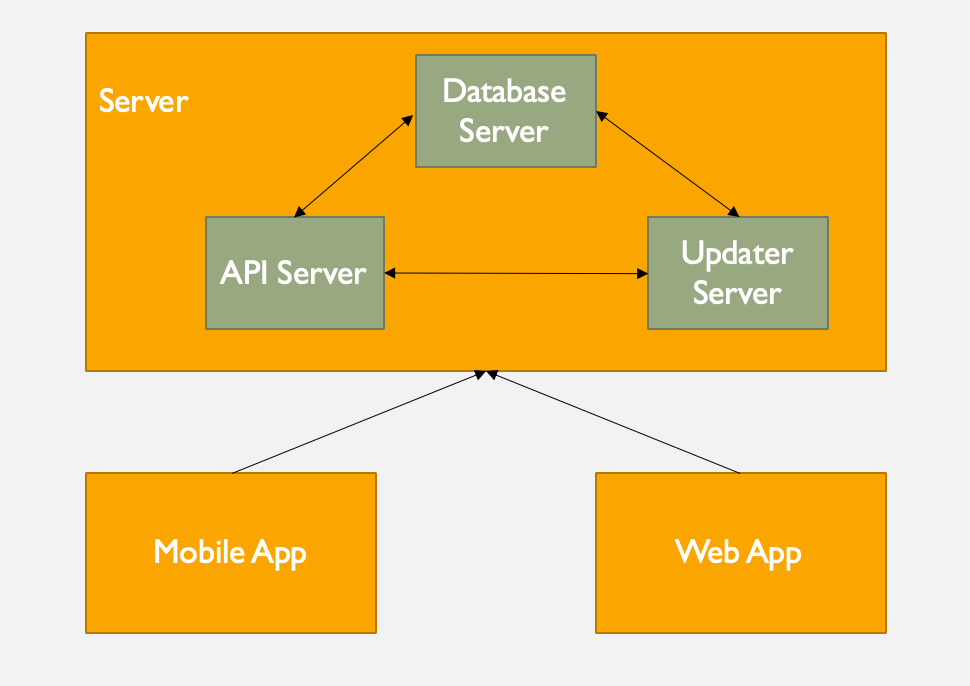

# 1. Overview

BK Traffic System includes four main components:

- Database Server
- Api Server
- Updater Server
- Client Apps (Mobile App and Web App)

This document will only explain about Database, API and Updater Server. The client apps will be explain on another.
