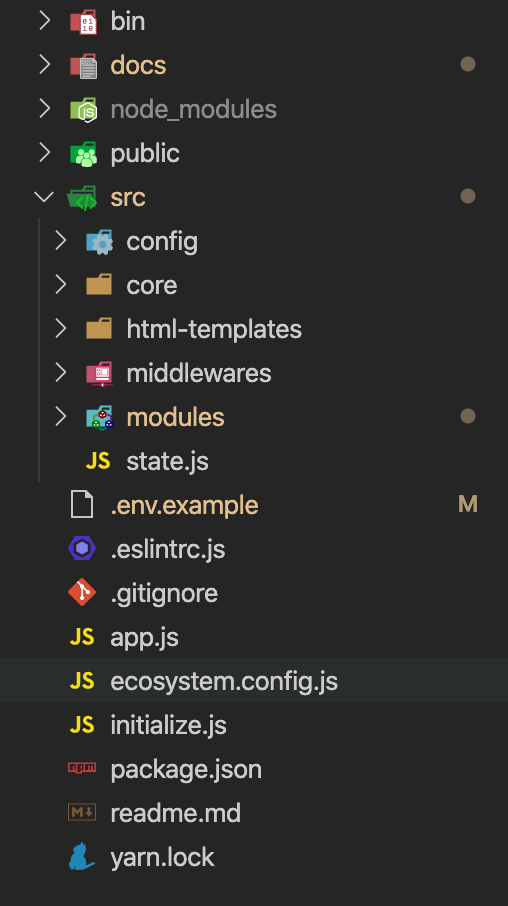

# 5. API Server Structure

API Server have been written by NodeJS. This session will discuss about how structure files and folders.

## /bin

The server will bootstrap from file `www` in this folder. You don't need to care this folder.

## /docs

The folder store document.

## /node_modules + yarn.lock

Automatically generate folder. Skip it.

## /public

This folder will store files, images,... that have been uploaded by user.

## app.js

The file is responsible for connecting the modules

## initialize.js

Some code require run firstly. It will be place on this file.

## ecosystem.config.js

This file has configuration for deploying server.

## /src

This is main folder. Almost code will be store in it.

### /src/config

Includes some files that defined some config for whole server. 

Example: name of collections, path to store uploaded files,...

### /src/core

Includes common modules such as: `response`, `logger service`, `email service`, `database service`,`validator`,....

### /src/html-templates

Includes templates that used to create email content such as: `forgot password email`, `verify account email`,...

### /src/middleware

Includes middleware such as: `auth middleare`,...

### /src/modules

Each feature of app is a module. This folder consist of all modules.

Each module will be consist four parts:

- __Models:__ Define schema that use for database.
- __Services:__ Define functions that was use by `controller` and `other module`.
- __Controller:__ Each function of controller is full code of a API. These were used by `router`.
- __Routers:__ Define API endpoint.
