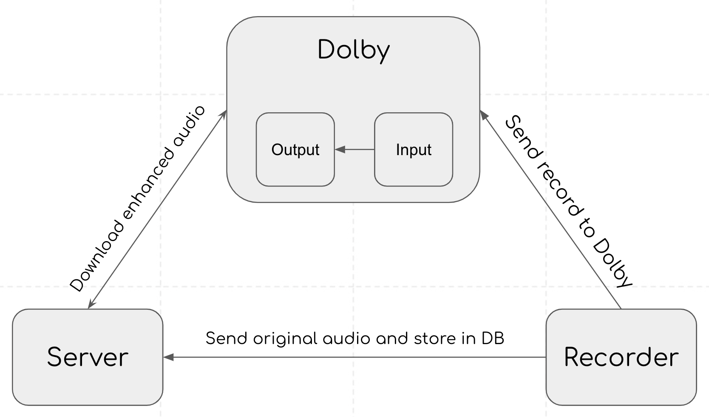

# 7. Dolby API

[Dolby](https://dolby.io/) is used to handle background noise cancelling job.

According to the figure above, Recorder of SpeechReport feature or DataCollecting feature will send the audio to Dolby and request Dolby to handle the noise reduction job.
From the serverside, BKTraffic server will downlload the enhanced audio and store it in database.

Checkout this document: [Media Enhance Dolby](https://docs.dolby.io/media-apis/reference/media-enhance-overview)

Note: In future, if you want to send a bigger audio file or limit the body size when sending data between client side and server side using post request, you can change the client_max_body_size of nginx. Checkout this document [Nginx configure](https://docs.rackspace.com/support/how-to/limit-file-upload-size-in-nginx/)
